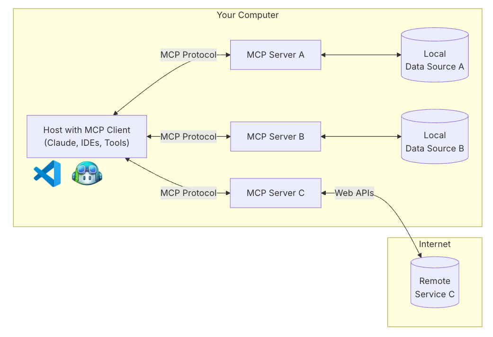
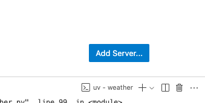
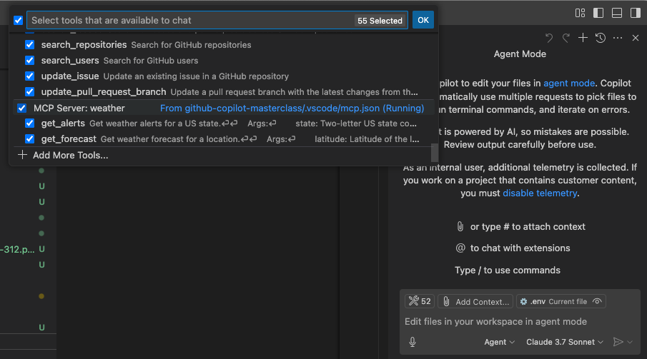
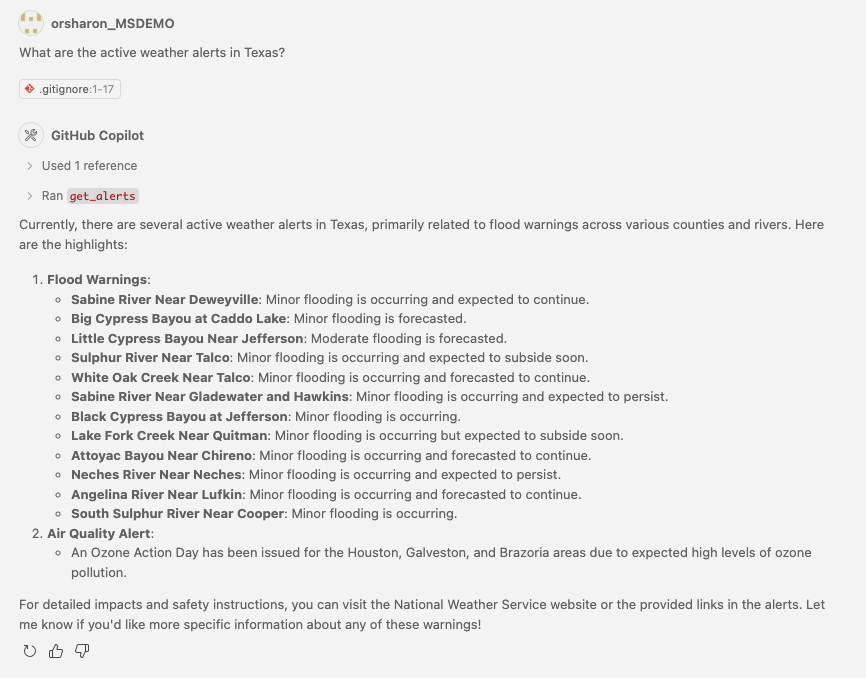

# Enterprise-Grade AI Extensibility with GitHub Copilot and Model Context Protocol (MCP)


## Building Technical Augmentation Layers for AI Systems

### Model Context Protocol: Technical Overview and Enterprise Value
Model Context Protocol (MCP) addresses a fundamental limitation in modern Large Language Models (LLMs) like GitHub Copilot: the inability to access real-time external data or perform computations outside their trained parameters. MCP provides a standardized communication framework that enables LLMs to securely interact with external systems, giving enterprises the ability to:

- **Extend AI capabilities** with domain-specific tools and data sources
- **Maintain data sovereignty** by keeping sensitive information outside the AI model
- **Enable real-time interactions** with internal systems and APIs
- **Implement authentication and authorization** for secure use of enterprise resources

For implementation reference and available MCP servers, check the official [MCP servers repository](https://github.com/modelcontextprotocol/servers). This repository centralizes MCP server implementations from various providers, offering a standardized way to extend AI capabilities with custom tools.

Our demonstration implements a weather information server that exposes two technically robust tools:
- `get-alerts`: Fetches active weather alerts for any US state through authenticated API calls
- `get-forecast`: Retrieves detailed meteorological data by precise geospatial coordinates

This technical guide demonstrates how to implement, configure, and integrate custom AI augmentation layers within your enterprise development environment.

### MCP Technical Architecture and Components
The Model Context Protocol implements a client-server architecture with three primary abstraction types:

* **Resources**: File-like data structures that function as transfer objects between server and AI clients (JSON payloads, binary data, structured text)
* **Tools**: Function endpoints with strongly-typed input/output contracts that LLMs can programmatically invoke after user authorization
* **Prompts**: Templated instruction sets for enhancing AI agent capabilities with domain-specific guidance

## Enterprise MCP Extension Architecture



The MCP architecture enables secure, controlled access to enterprise systems and data while maintaining clear separation of concerns. This pattern can be extended to integrate with:

- **Internal Knowledge Bases**: Connect Copilot to proprietary documentation and company wikis
- **Enterprise Data Warehouses**: Enable AI querying of business intelligence with proper authorization
- **Custom Toolchains**: Integrate with internal build systems, deployment pipelines, and monitoring tools
- **Legacy Systems**: Create MCP wrappers around existing enterprise systems with RESTful or RPC interfaces
- **Authentication Services**: Implement company SSO and access control for AI-driven operations


## Technical Implementation Guide
> Full sample can be found in [weather-sample directory](/weather-sample)

### 1. Install UV Package Manager and Set Up Python Environment

First, install the UV package manager and restart your terminal:
```bash
curl -LsSf https://astral.sh/uv/install.sh | sh
```

### 2. Create Your Weather Project Structure
```bash
# Create a new directory for our project
uv init weather --no-workspace
cd weather

# Create virtual environment and activate it
uv venv
source .venv/bin/activate

# Install dependencies
uv add "mcp[cli]" httpx

# Create our server file
touch weather.py
```

### 3. Implement the MCP Weather Server
Add this Python code to your `weather.py` file:
```python
from typing import Any
import httpx
from mcp.server.fastmcp import FastMCP

# Initialize FastMCP server
mcp = FastMCP("weather")

# Constants
NWS_API_BASE = "https://api.weather.gov"
USER_AGENT = "weather-app/1.0"

# HELPER TOOLS
#  helper functions for querying and formatting the data from the National Weather Service API
async def make_nws_request(url: str) -> dict[str, Any] | None:
    """Make a request to the NWS API with proper error handling."""
    headers = {
        "User-Agent": USER_AGENT,
        "Accept": "application/geo+json"
    }
    async with httpx.AsyncClient() as client:
        try:
            response = await client.get(url, headers=headers, timeout=30.0)
            response.raise_for_status()
            return response.json()
        except Exception:
            return None

def format_alert(feature: dict) -> str:
    """Format an alert feature into a readable string."""
    props = feature["properties"]
    return f"""
Event: {props.get('event', 'Unknown')}
Area: {props.get('areaDesc', 'Unknown')}
Severity: {props.get('severity', 'Unknown')}
Description: {props.get('description', 'No description available')}
Instructions: {props.get('instruction', 'No specific instructions provided')}
"""

# EXCECUTION TOOLS
# The tool execution handler is responsible for actually executing the logic of each tool.
@mcp.tool()
async def get_alerts(state: str) -> str:
    """Get weather alerts for a US state.

    Args:
        state: Two-letter US state code (e.g. CA, NY)
    """
    url = f"{NWS_API_BASE}/alerts/active/area/{state}"
    data = await make_nws_request(url)

    if not data or "features" not in data:
        return "Unable to fetch alerts or no alerts found."

    if not data["features"]:
        return "No active alerts for this state."

    alerts = [format_alert(feature) for feature in data["features"]]
    return "\n---\n".join(alerts)

@mcp.tool()
async def get_forecast(latitude: float, longitude: float) -> str:
    """Get weather forecast for a location.

    Args:
        latitude: Latitude of the location
        longitude: Longitude of the location
    """
    # First get the forecast grid endpoint
    points_url = f"{NWS_API_BASE}/points/{latitude},{longitude}"
    points_data = await make_nws_request(points_url)

    if not points_data:
        return "Unable to fetch forecast data for this location."

    # Get the forecast URL from the points response
    forecast_url = points_data["properties"]["forecast"]
    forecast_data = await make_nws_request(forecast_url)

    if not forecast_data:
        return "Unable to fetch detailed forecast."

    # Format the periods into a readable forecast
    periods = forecast_data["properties"]["periods"]
    forecasts = []
    for period in periods[:5]:  # Only show next 5 periods
        forecast = f"""
{period['name']}:
Temperature: {period['temperature']}°{period['temperatureUnit']}
Wind: {period['windSpeed']} {period['windDirection']}
Forecast: {period['detailedForecast']}
"""
        forecasts.append(forecast)

    return "\n---\n".join(forecasts)

# Running the server
if __name__ == "__main__":
    # Initialize and run the server
    mcp.run(transport='stdio')
```

Run `uv run weather.py` to confirm that everything's working.
> **Technical Implementation Analysis:** 
> 1. **Type Contract Generation**: FastMCP utilizes Python's type annotation system and docstring parsing to automatically generate OpenAPI-compatible tool definitions, ensuring strict interface contracts between the LLM and execution environment.
> 2. **Exception Boundary Design**: Helper functions (`make_nws_request`, `format_alert`) implement proper error boundaries and failure recovery mechanisms for resilient API interactions.
> 3. **Asynchronous Service Architecture**: Tool handlers leverage Python's async/await pattern to manage I/O-bound operations efficiently, preventing thread blocking during HTTP requests.
> 4. **Payload Transformation**: The implementation demonstrates proper data transformation patterns between the external API format and the standardized output format expected by the MCP consumer.

### 4. Infrastructure Integration with VSCode Development Environment
To expose your MCP endpoints to GitHub Copilot's inference system, you need to configure proper service discovery within your VSCode workspace environment. Choose one of the following integration methods:

#### Option 1: Manual Infrastructure Configuration
1. Create a `.vscode/mcp.json` file in your workspace.
2. Add this configuration:
    ```json
    {
        "servers": {
            "weather": {
                "type": "stdio",
                "command": "uv",
                "args": [
                    "--directory",
                    "/ABSOLUTE/PATH/TO/PARENT/FOLDER/weather",
                    "run",
                    "weather.py"
                ]
            }
        }
    }
    ```
3. Save the file to apply your configuration.

#### Option 2: Using VSCode's Configuration Interface
1. Create the `.vscode/mcp.json` file and use the configuration button in the bottom right corner of VSCode.  
    
2. Alternatively, run the `MCP: Add Server` command from the Command Palette and follow the prompts.

> **Advanced Integration Options:** For production environments, explore additional configuration parameters including authentication mechanisms, request timeouts, service health monitoring, and transport encryption in the [official VSCode documentation](https://code.visualstudio.com/docs/copilot/chat/mcp-servers).

### 5. Enterprise Use Cases and Technical Integration

Once your MCP server infrastructure is properly configured, your AI assistant can access these enterprise capabilities programmatically:

1. Open the GitHub Copilot Chat view (⌃⌘I) and select **Agent** mode from the dropdown.  
    
2. Click the Tools button to see your registered service endpoints.  
    
3. Test your implementation with enterprise-relevant queries:

#### Example Use Cases:

**1. Field Operations Management**
- Query: `Check weather alerts for all our TX field operations teams`
- Implementation: The agent automatically invokes `get-alerts` with state="TX", parsing the response to prioritize high-severity alerts.

**2. Supply Chain Logistics**
- Query: `Will there be weather events affecting our Denver distribution center next week?`
- Implementation: The agent determines the coordinates (39.7392, -104.9903), calls `get-forecast`, and analyzes the forecast to detect potential distribution disruptions.

**3. Facilities Management**
- Query: `Do we need to implement our severe weather protocol at our Miami office?`
- Implementation: The assistant calls `get-alerts` with state="FL", analyzes severity levels, and provides a recommendation based on company protocols.

**4. Disaster Recovery Planning**
- Query: `Generate a potential incident response for our California servers based on current weather alerts`
- Implementation: The agent queries `get-alerts` with state="CA", then synthesizes an incident response plan considering the specific alert types.



## GitHub Copilot Masterclass

Enjoyed this exercise? Take your skills to the next level with the [GitHub Copilot Masterclass](https://github.com/orsharon7/github-copilot-masterclass). In this course, you'll build a complete application from an image and create an MCP server with "Steve Jobs" as your virtual Product Manager, guiding you to design and implement innovative features.

## Enterprise Integration and Technical Resources
- [GitHub MCP Server Implementation Repository](https://github.com/github/github-mcp-server)
- [Model Context Protocol Technical Specification](https://modelcontextprotocol.io/introduction)
- [VSCode MCP Integration Documentation](https://code.visualstudio.com/docs/copilot/chat/mcp-servers)